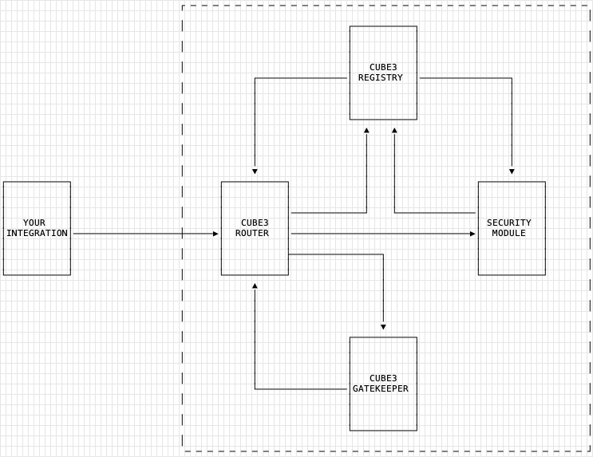

# CUBE3 Smart Contract Integration

This repository contains the CUBE3 Integration smart contracts, along with instructions for connecting your integration to the CUBE3 protocol. Adding the CUBE3 integration contracts to your smart contracts enables RASP (Runtime Application Self Protection) when used in conjunction with the CUBE3 service.

Creating both a standalone and proxy integration is demonstrated in the [cube3-integration-foundry-demo](https://github.com/cube-web3/cube3-integration-foundry-demo) repo.

The guide is broken down into the following sections:

1. [Integration Overview](#integration-overview)
2. [Integration Guide](#integration-guide)
3. [Testing](#testing)
4. [Protocol Overview](#protocol-overview)
5. [Demo Contracts](#demo-contracts)

# Integration Overview

What is an "integration"?

Creating an integration involves inheriting from the CUBE3 base contracts and connecting your contract (ie your integration) to the CUBE3 protocol on-chain.

The following section describe the steps for creating an integration:

- Add the CUBE3 contracts to your codebase
- Import and inherit from `Cube3Integration.sol` or `Cube3IntegrationUpgradeable.sol` depending on your use-case
- Add the `cube3Protected` modifier to the functions you wish to add RASP functionality for and add the `cube3SecurePayload` as a function argument
- [Optional] Incorporate the `_securityAdmin` account with your chosen access control pattern
- Supporting ERC165
- Deploy your contract/s
- [Optional] Update the Security Admin account
- Register for the CUBE3 service, apply for your registrar token, and register your integration on-chain
- [Optional] Enable/Disable the protection status of your protected functions

For a standalone integration, your contract will inherit from `Cube3Integration.sol`. If your contracts use a proxy pattern, you'll need to inherit from `Cube3IntegrationUpgradeable.sol`.

CUBE3 Smart Contracts use Solidity version `0.8.19`.

<br>

# Integration Guide

## Step 1: Install the CUBE3 contracts using your package manager of choice

`Cube3Protected.sol` leverages [OpenZeppelin's](https://www.openzeppelin.com/) ERC165 and Context implementations, so these will need to be installed along with the CUBE3 contracts.

### Hardhat (NPM or Yarn)

```bash
npm install --save-dev @cube-web3/cube3-integration @openzeppelin/contracts @openzeppelin/openzeppelin-contracts-upgradeable
```

### Foundry (Forge)

```bash
forge install cube-web3/cube3-integration @openzeppelin/openzeppelin-contracts @openzeppelin/openzeppelin-contracts-upgradeable
```

Next, you'll need to update your `foundry.toml` and `remappings.txt` files.

Update your foundry.toml remappings - the entry should look something like. Make sure to include the `auto_detect_remappings` line:

```
remappings = [
    "forge-std/=lib/forge-std/src/",
    "ds-test/=lib/forge-std/lib/ds-test/src/",
    "@openzeppelin/contracts=lib/openzeppelin-contracts/contracts/",
    "@openzeppelin/contracts-upgradeable=lib/openzeppelin-contracts-upgradeable/contracts/",
    "cube3/=lib/cube3-integration/"
]

auto_detect_remappings = false
```

This will prevent the protocol repo's remappings from interfering with your own. Bear in mind the that you'll need to add any additional packages to your foundry.toml' s remappings property.

Then update your `remappings.txt `file.

```shell
forge remappings > remappings.txt
```

## Step 2: Import and inherit a CUBE3 base contract

Follow section 2.1 if your integration is a standalone contract, or 2.2 if you're using a proxy pattern.

For both sets of base contracts, the CUBE3 protocol contract addresses are derived from `contracts/utils/ProtocolContractsByChain.sol`, so there's no need to pass them to the constructor.

### Step 2.1: Standalone integration

Below is an example of including the `Cube3Integration.sol` contract in a standalone contract. `Cube3Integration.sol` inherits from `contracts/utils/SecurityAdmin2Step.sol`, which sets the default Security Admin as the deployer and manages access control for integration-related privileged functions.

```solidity
import {Cube3Integration} from "cube3/contracts/Cube3Integration.sol";

contract MyIntegration is Cube3Integration {
    ...
    constructor(...args) Cube3Integration() {
        ...
    }
}
```

### Step 2.2: Upgradeable/proxy integration

**Important Note: This example is not an exhaustive demonstration of using the CUBE3 upgradeable contracts for all possible proxy patterns, but rather demonstrating usage in a single scenario.**

Below is an example of inheriting the `Cube3IntegrationUpgradeable.sol` contract into an upgradeable contract using the UUPS proxy pattern. Because initializers are not linearized by the compiler like constructors, we want to avoid initializing the same contract twice. As such, we follow OpenZeppelin's standards for Multiple Inheritance utilizing the `_init` and `_init_unchained` pattern. Upgradeable integrations will call `__Cube3IntegrationUpgradeable_init(...args) `inside their own initialize functions.
Unlike the standalone implementation of `Cube3Integration.sol` that inherits `SecurityAdmin2Step.sol`, which sets the default Security Admin as the deployer, the upgradeable version requires the Security Admin be set explicitly. This provides flexibility for proxy patterns, such as the minimal forwarder proxy, that utilize a factory contract, whereby the deployer would be the factory contract if it was set implicitly. The integration **MUST** initialize `Cube3IntegrationUpgradeable` in its initialize function to set the protocol contract addresses (implicitly) and the security admin account (explicitly).

Eg:

```solidity
import {Cube3IntegrationUpgradeable} from "cube3/contracts/upgradeable/Cube3IntegrationUpgradeable.sol";
import {UUPSUpgradeable} from "@openzeppelin/contracts-upgradeable/proxy/utils/UUPSUpgradeable.sol";

contract MyIntegrationUpgradeable is UUPSUpgradeable, Cube3IntegrationUpgradeable {

   function initialize(
      ...args,
      address securityAdmin,
   ) external initializer {

      // Do something with the ...args

       __UUPSUpgradeable_init();
       __Cube3IntegrationUpgradeable_init(securityAdmin);
   }

    // upgradeability will be covered in a later section
    function _authorizeUpgrade(address newImplementation) internal virtual override onlySecurityAdmin {
        _preAuthorizeNewImplementation(newImplementation);
    }

}
```

For use cases such as the UUPS pattern, the `Cube3IntegrationUpgradeable.sol` contract exposes the `internal _preAuthorizeNewImplementation()` function, which should be called inside `_authorizeUpgrade()`. This ensures that the new implementation contract is recognized by the protocol as soon as it's deployed.

### Step 3: Add the {cube3Protected} modifier to your functions

Decorate the functions you wish to protect with the cube3Protected modifier. Both `Cube3Integration.sol` and `Cube3IntegrationUpgradeable.sol` contain the definition for the `cube3Protected` modifier. The modifier accepts a `cube3SecurePayload` of type `bytes` and its definition is as follows (implementation details omitted for brevity):

```solidity
modifier cube3Protected(bytes calldata cube3SecurePayload) {
    ...
    _;
}
```

The modifier uses the `calldata` storage location as it's strictly read-only. This further reduces the gas overhead of the function call. The `cube3SecurePayload` should be included as **the final** parameter in the protected function's signature, such that it can be passed on to the modifier and correctly parsed by the Cube3Router.

Eg.

```solidity
function mint(
  uint256 tokenId,
  string memory name,
  bytes calldata cube3SecurePayload
) external cube3Protected(cube3SecurePayload) {
  // ...
}
```

**NB:** As mentioned, the protected function's definition MUST include the `bytes calldata cube3SecurePayload` as the last argument. If the payload is not included as the last argument, any calls to the Router will fail and the transaction will revert.
Eg.

```solidity
// Good
function mint(uint256 qty, bytes calldata cube3SecurePayload) external payable cube3Protected(cube3SecurePayload) {
  // function logic ommitted for brevity
}

// Good
function burn(uint256 tokenId, bytes calldata cube3SecurePayload) external cube3Protected(cube3SecurePayload) {
  // function logic ommitted for brevity
}

// Bad, will revert
function mint(
  uint256 qty,
  bytes calldata cube3SecurePayload,
  uint256 value
) external payable cube3Protected(cube3SecurePayload) {
  // function logic ommitted for brevity
}
```

Adding the modifier and payload adds RASP functionality to the burn and mint functions shown above, however the function-level protection status will need to be updated in a separate step to the RASP functionality - this process is covered in the steps that follow. Note that the modifier can be applied to both payable and non-payable functions.

### Step 4: [Optional] Modify your access control patterns for the Security Admin

**Important Note: This is not an exhaustive guide for usage with all access control patterns, but rather a demonstration of how to integrate with a few common patterns.**

`Cube3Integration.sol` inherits from `SecurityAdmin2Step.sol`, whereas `Cube3IntegrationUpgradeable.sol` inherits from `SecurityAdmin2StepUpgradeable.sol`. This access control pattern is based on OpenZeppelin's Ownable2Step where the new admin account needs to call a function to accept the transfer of the Security Admin account.
This step is marked as _optional_ because the contract can still be managed without altering your contract's access control patterns. The implication is simply that the `_securityAdmin` account is assigned to contract's deployer and can be left as is, or transferred to a separate address.

This can be achieved using the external `{transferSecurityAdministration}` made available by the selected base contract.

```solidity
/// @notice Explain to an end user what this does
/// @dev Starts the security admin transfer.
/// @dev Can only be called by the current _securityAdmin.
/// @dev Overridden functions MUST include {onlySecurityAdmin} modifier to maintain security functionalitys.
/// @dev No need for Zero address validation as the Zero address cannot call {acceptSecurityAdministration}
///      and _pendingSecurityAdmin can be overwritten.
/// @param newAdmin The address of the account waiting to accept the {_securityAdmin} role.
function transferSecurityAdministration(address newAdmin) public virtual onlySecurityAdmin {
  _pendingSecurityAdmin = newAdmin;
  emit SecurityAdminTransferStarted(securityAdmin(), newAdmin);
}

/// @dev Encapsulates the transfer and event emission for easy reuse.
/// @dev Can be used by inheritor to integrate with desired access control patterns.
function _transferSecurityAdministration(address newAdmin) internal {
  _beforeSecurityAdminTransfer(newAdmin);
  address oldAdmin = _securityAdmin;
  _securityAdmin = newAdmin;
  emit SecurityAdministrationTransferred(oldAdmin, newAdmin);
}

/// @dev Hook that is called before the security admin is set to a new address.
function _beforeSecurityAdminTransfer(address newAdmin) internal virtual {}
```

The inclusion of `SecurityAdmin2Step` is explicitly different from OpenZeppelin's `Ownable2Step` to avoid any potential conflicts should you choose to use that access control pattern. The `_securityAdmin` is set implicitly to the deployer's address in the `Cube3Integration.sol` contract's constructor, or set explicitly in `{Cube3IntegrationUpgradeable-initialize}` function. This account has elevated permissions, allowing it to register the integration with the CUBE3 Protocol, as well as enable/disable the protection status of functions decorated with the `cube3Protected` modifier.

```solidity
// SecurityAdmin2Step.sol || SecurityAdmin2StepUpgradeable.sol

// the current security admin for the derived contract
address private _securityAdmin;

// the pending security admin for the derived contract, once accepting the role will be transferred to the _securityAdmin
address private _pendingSecurityAdmin;
```

Presented below is an example integration using OpenZeppelin's Ownable access pattern. In this scenario, the `owner` and `_securityAdmin` accounts are aligned to be the same EOA.

Please note: this is not a recommendation or suggestion of best practices, it is simply a demonstration of how to override the internal functions provided. In this example, it should also be noted that while the ownership would be transferred to the newAdmin address, the EOA would still need to call `acceptSecurityAdministration()`. It's up to you to determine how the Security Admin account is managed.

```solidiy
contract ExampleIntegrationOwnable is Cube3Integration, Ownable {
    constructor() Cube3Integration() {}

    function transferSecurityAdministration(address newAdmin) public override
    onlySecurityAdmin {
        _transferOwnership(newAdmin);
        _transferSecurityAdministration(newAdmin);
    }
}
```

Another example use/s OpenZeppelin's AccessControl. This example is more nuanced, and assigns the example contract's deployer the `EXAMPLE_ADMIN_ROLE`, this role would then be used to execute functions that require elevated privileges in the example contract. Should the contract's deployer want the `_securityAdmin` and `EXAMPLE_ADMIN_ROLE` to be the same account, the role can be granted and revoked in the `_beforeSecurityAdminTransfer` hook.

```solidity
contract ExampleIntegrationAccessControl is Cube3Integration, AccessControl {
  bytes32 constant EXAMPLE_ADMIN_ROLE = keccak256(abi.encode('EXAMPLE_ADMIN_ROLE'));

  // deployer is security admin by default
  constructor(address Cube3RouterProxy) Cube3Integration() {
    _grantRole(EXAMPLE_ADMIN_ROLE, msg.sender);
  }

  function transferSecurityAdministration(
    address newAdmin
  ) public override onlySecurityAdmin onlyRole(EXAMPLE_ADMIN_ROLE) {
    _grantRole(EXAMPLE_ADMIN_ROLE, newAdmin);
    _revokeRole(EXAMPLE_ADMIN_ROLE, msg.sender);
    _transferSecurityAdministration(newAdmin);
  }

  function supportsInterface(
    bytes4 interfaceId
  ) public view virtual override(AccessControl, Cube3Integration) returns (bool) {
    // is the same as  return AccessControl.supportsInterface(interfaceId) || Cube3Protected.supportsInterface(interfaceId);
    // due to linearization, it will first call Cube3Protected's implementation due to the linearization order. Because Cube3Protected also uses the super
    // keyword, it will then call AccessControl's implementation.
    return super.supportsInterface(interfaceId);
  }
}
```

An important note for the above implementation is that both OpenZeppelin's AccessControl and Cube3Integration implement ERC165 and, as such, the `{supportsInterface}` function needs to be overridden. This is discussed in detail in the section that follows.

### Step 5: Supporting ERC165

This step is optional and only relevant if your contract implements the ERC165 interface. If your contract does not implement ERC165, you can skip this step.
If your contract does implement ERC165, or inherits from another contract that implements it, you'll need to override the `supportsInterface` function and override each contract that implements ERC165.

The following example shows how to override `supportsInterface`, which is present in both the `Cube3Integration` and OpenZeppelin AccessControl contracts.

```solidity
function supportsInterface(
  bytes4 interfaceId
) public view virtual override(AccessControl, Cube3Integration) returns (bool) {
  return super.supportsInterface(interfaceId);
}
```

Using `super.supportsInterface(interfaceId)` is the same as `AccessControl.supportsInterface(interfaceId) || Cube3Integration.supportsInterface(interfaceId)` due to linearization. It will first call `Cube3Integration`'s implementation due to the linearization order. Because `Cube3Integration` also uses the `super` keyword, it will then call AccessControl's implementation.

### Step 6: Deploy your contracts

Deploy your contracts to your network of choice, using your preferred tooling, eg. Hardhat, Foundry etc.

If utilizing a proxy, and deploying via hardhat, it's likely you're using the Hardhat Upgrades Plugin. For security purposes the immutable variable `_self` is set in the Cube3IntegrationUpgradeable constructor during the integration's implementation contract's deployment.

```solidity
// Cube3IntegrationUpgradeable.sol
constructor() {
  _self = address(this);
}
```

This creates a reference to the integration's own implementation address that's stored in the contract's bytecode, so is not subject to being bypassed via a delegate call that would read from the caller's state.
As such, we need to tell the plugin to allow the constructor using the unsafeAllow option when deploying the proxy.

```javascript
{
  ...opts,
  initializer: 'initialize',
  unsafeAllow: ['constructor', 'state-variable-immutable'],
}
```

Which will show a warning like the following:

```shell
Warning: Potentially unsafe deployment of test/foundry/dummy/DummyIntegrationTransparent.sol:DummyIntegrationTransparent
​
You are using the `unsafeAllow.state-variable-immutable` flag.
​
Warning: Potentially unsafe deployment of test/foundry/dummy/DummyIntegrationTransparent.sol:DummyIntegrationTransparent
​
You are using the `unsafeAllow.constructor` flag.
```

### Step 7: Register your integration on-chain with the Cube3Router

This step is necessary to connect your smart contract to CUBE3's on-chain protocol.

**NB: A standalone integration can operate on-chain WITHOUT registering with the on-chain protocol, provided function-level protection remains disabled. Once registered, function-level protection can be disabled. However, an upgradeable integration MUST register with the on-chain protocol. Until an upgradeable integration is regsitered, any functions decorated with the modifier will revert, as function-level protection status is stored in the remote Cube3GateKeeper contract, and attempting to access its storage while unregistered will cause the transaction to revert.**

Registration on-chain can only be performed by the Security Admin EOA. In addition to registering your integration, you have the option to enable the protection status for each function that makes use of the `cube3protected` modifier, which is disabled by default - ie. it is opt-in.

Once your contract is deployed, you need to call the `{registerIntegrationWithCube3}` function on your contract to establish a connection to the CUBE3 protocol. See `{Cube3Integration-registerIntegrationWithCube3}` for as an example of the standalone contract's implementation details. This registers your contract as an integration with the Cube3Router, which is responsible for routing your users' transactions to the desired security modules. If you enable function-level protection before registering your integration, any calls to functions protected by the cube3Protected modifier with function protection enabled will revert.

When you register your contract (thus completing the creation of the integration), you can choose to enable none, some, or all of your protected functions by default.

Before you can register on-chain you need to acquire a registrar token from the CUBE3 web platform. Follow the instructions found [coming soon...]. Once you've acquired the token, your options are as follows:

#### Option 1: Register your integration and leave all function protection disabled.

To do this, you'll pass an empty `bytes4[]` (`bytes4` array) to registerIntegrationWithCube3.
An example, using javascript, is as follows:

```javascript
import { ethers } from 'ethers';
import dotenv from 'dotenv';

dotenv.config();

const contractABI = [
  /* ABI of your smart contract */
];
const contractAddress = '/* Your smart contract address */';
const securityAdminPrivateKey = process.env.SECURITY_ADMIN_PVT_KEY;
const provider = new ethers.providers.JsonRpcProvider('/* Your Ethereum node URL */');
const wallet = new ethers.Wallet(securityAdminPrivateKey, provider);

const registrarToken = process.env.REGISTRAR_TOKEN;

async function callRegisterIntegrationWithCube3() {
  const contract = new ethers.Contract(contractAddress, contractABI, wallet);
  const enabledByDefaultFnSelectors: bytes4[] = [];

  try {
    const tx = await contract.registerIntegrationWithCube3(registrarToken, enabledByDefaultFnSelectors);
    const receipt = await tx.wait();
    console.log('Transaction successful:', receipt);
  } catch (error) {
    console.error('Transaction failed:', error);
  }
}

callRegisterIntegrationWithCube3();
```

Passing an empty array will ensure that CUBE3 protection is left disabled for each function. You can then, at a time of your choosing, selectively enable which functions you wish to enable protection for.

#### Option 2: Enable some, or all, of your functions by default

To do this, pass a `bytes4[]` array containing the desired function selectors for each function you wish to enable protection for.
As an example, let's say your smart contract has the following two functions that you're applying the cube3protected modifier to:

```solidity
function registerForLottery(
  address accountToRegister,
  bytes calldata cube3securePayload
) public cube3protected(cube3securePayload) {
  // function logic ommitted for brevity
}

function castVote(
  address candidate,
  bool supported,
  bytes calldata cube3securePayload
) public cube3protected(cube3securePayload) {
  // function logic ommitted for brevity
}
```

The function selectors for the two functions are as follows:

`registerForLottery(address,bytes) : 0xffa86eac`

`castVote(address,bool,bytes) : 0x7da26bbe`

So, if we want to enable CUBE3 protection for both of these functions by default, we'll pass in `0xffa86eac` and `0x7da26bbe` in the `bytes4[]`. Eg.

```javascript
import { ethers } from 'ethers';

const contractABI = [
  /* ABI of your smart contract */
];
const contractAddress = '/* Your smart contract address */';
const securityAdminPrivateKey = process.env.SECURITY_ADMIN_PVT_KEY;
const provider = new ethers.providers.JsonRpcProvider('/* Your Ethereum node URL */');
const wallet = new ethers.Wallet(securityAdminPrivateKey, provider);

const registrarToken = process.env.REGISTRAR_TOKEN;

async function callRegisterIntegrationWithCube3() {
  const contract = new ethers.Contract(contractAddress, contractABI, wallet);
  const enabledByDefaultFnSelectors: bytes4[] = ['0xffa86eac', '0x7da26bbe'];

  try {
    const tx = await contract.registerIntegrationWithCube3(registrarToken, enabledByDefaultFnSelectors);
    const receipt = await tx.wait();
    console.log('Transaction successful:', receipt);
  } catch (error) {
    console.error('Transaction failed:', error);
  }
}

callRegisterIntegrationWithCube3();
```

### Step 8: Update the protection status of your functions

At any given point, once your integration has been registered, you have granular control over which functions you'd like to enable/disable. You can update the status of an individual function, or multiple functions at the same time.

To change the status of multiple functions at the same time, you can call: `function setFunctionProtectionStatus( bytes4[] calldata fnSelectors, bool[] calldata isEnabled)`, where the boolean at any given index in the `bool[]` applies to the function selector at the corresponding index in the fnSelectors `bytes4[] `array.

```javascript
import { ethers } from 'ethers';

const contractABI = [
  /* ABI of your smart contract */
];
const contractAddress = '/* Your smart contract address */';
const securityAdminPrivateKey = '/* Your private key */';
const provider = new ethers.providers.JsonRpcProvider('/* Your Ethereum node URL */');
const wallet = new ethers.Wallet(securityAdminPrivateKey, provider);

// In this example, we enable `0xffa86eac` and disable `0x7da26bbe`
async function setFunctionProtectionStatus() {
  const contract = new ethers.Contract(contractAddress, contractABI, wallet);
  const fnSelectors: bytes4[] = ['0xffa86eac', '0x7da26bbe'];
  const isEnabled: boolean[] = [true, false];

  try {
    const tx = await contract.setFunctionProtectionStatus(fnSelectors, isEnabled);
    const receipt = await tx.wait();
    console.log('Transaction successful:', receipt);
  } catch (error) {
    console.error('Transaction failed:', error);
  }
}

setFunctionProtectionStatus();
```

# Unit Testing

An important consideration when unit testing is that the estimated gas usage for any protocol interactions will not be accurate.

## Foundry

For unit testing with Foundry, a set of Mock contracts are available that simulate the CUBE3 protocol contracts. These can be imported from `cube3/test/foundry/utils/` and are as follows.

```
import {Cube3ProtocolTestUtils} from "cube3/test/foundry/utils/deploy.sol";
```

The `Cube3ProtocolTestUtils` inherits Foundry's `Test` contracts, so there's no need to explicitly import them if using the `Cube3ProtocolTestUtils` contract. The utils include the `_deployMockCube3Protocol()` function, which deploys a mock router and gatekeeper to the expected addressed. Example usage:

```solidity
contract YourTest is Cube3ProtocolTestUtils {
  function setUp() public {
    _deployMockCube3Protocol();
  }

  // unit tests
}
```

In order to deploy your own integration, the protocol contract's need to be present, or the Cube3Integration constructor will revert.

## Hardhat

Coming soon...

<br>

# The CUBE3 protocol

## Introduction

Making use of CUBE3's RASP (Runtime Application Self Protection) functionality requires that your smart contracts be integrated with the CUBE3 protocol on-chain. Creating your integration involves the following steps:

- Inheriting from a CUBE3 base contract. This will be the Cube3Integration.sol contract if yours is a standalone contract implementation, or Cube3IntegrationUpgradeable.sol if you're using a proxy pattern.
- Deploying your integration to a supported network - see the list of supported networks [here](https://docs.cube3.ai/supported-blockchain-networks/cube3-protect-products).
- Decorating the functions you wish to protect with the cube3Protected modifier and including the cube3SecurePayload as a function argument (covered in [Step 3](#step-3-add-the-cube3protected-modifier-to-your-functions))
- Creating an account with CUBE3 and registering your integration on-chain with the CUBE3 protocol (covered in [docs coming soon...]).

For the sake of clarity, any mention of "an integration" or "your integration" from this point onwards refers to your deployed smart contract/s that have inherited from one of the CUBE3 base contracts.

Both CUBE3 base contracts share the same interface:

```solidity
interface ICube3Integration {
  event Cube3IntegrationDeployment(address indexed self, address indexed admin);
  event StandaloneFunctionProtectionStatusUpdated(bytes4[] fnSelectors, bool[] enabled);

  function registerIntegrationWithCube3(
    bytes calldata registrarSignature,
    bytes4[] calldata enabledByDefaultFnSelectors
  ) external;

  function setFunctionProtectionStatus(bytes4[] calldata fnSelectors, bool[] calldata isEnabled) external;

  function self() external view returns (address, address);

  function isFunctionProtectionEnabled(bytes4 fnSelector) external view returns (bool);

  function batchIsFunctionProtectionEnabled(bytes4[] calldata fnSelectors) external view returns (bool[] memory);
}
```

This guide will walk you through the steps required to integrate your smart contract with the CUBE3 protocol. After laying out basic installation instructions for including the CUBE3 contracts in your code, this guide will present the steps required to integrate as either a standalone, or an upgradeable contract. Should your contract use a proxy pattern, you'll be inheriting from the upgradeable base contract ( `Cube3IntegrationUpgradeable.sol` ). If not, you'll be inheriting from the standalone base contract ( `Cube3Integration.sol` ). It's very important to include the correct contract, as the standalone contract includes code that will force any `delegatecalls` to revert, meaning it is incompatible with all proxy patterns.

**Important Considerations**:

- An upgradeable/proxy integration MUST be registered with the CUBE3 protocol, even if function-level protection remains disabled, or else calls to protected functions will revert. A standalone integration will not revert calls if the contract remains unregistered.
- An upgradeable integration MUST follow the CUBE3 upgradeable integration guidelines, ensuring that new implementations are correctly registered on-chain.
- The CUBE3 integration contracts leverage OpenZeppelin library contracts, namely: ERC165, `ERC165Upgradeable`, and `ERC165CheckerUpgradeable`. This should be taken into consideration when inheriting from the abstract CUBE3 contracts.

## Protocol Overview

In order to understand the process of creating an integration, it's important to have a high-level understanding of how the protocol operates. For a more detailed and/or technical explanation, please refer to the CUBE3 Protocol Documentation [link here].

The CUBE3 protocol provides access to a suite of security modules that can be used to add additional layers of security to your contract's on-chain activities. Security modules are designed and deployed by CUBE3. In addition to the protocol being reviewed by independent security auditors, each module that's deployed will undergo its own independent review.



### The Router

1. The CUBE3 Router is the only contract that your integration will interact with directly. As far as an integration is concerned, the Router has 3 primary functions:
1. Controls what integrations are permitted to register with the protocol.
1. Prevents unauthorized accounts/contracts from accessing the security modules.
   Routes requests to the appropriate security module.

### The GateKeeper

The GateKeeper is a decentralized storage contract that keeps track of which integrations are registered with the protocol, along with their authorization status. Unlike a standalone integration, a proxy/upgradeable integration does not store the function-level protection status in its own contract. For security reasons, the protection status of each function is stored in the GateKeeper.

### Security Modules

The security modules provide application-specific functionality. For example, the `Cube3SignatureModule.sol` contract verifies the signature contained in the `cube3SecurePayload` that's passed in during a call to an integration's protected function.

This signature is generated by the CUBE3 Risk API, and is used to verify that the request is coming from an authorized account and that the transaction is valid. The `Cube3SignatureModule.sol` contract is the only security module that's currently available, but more will be added in the future.

### The Registry

The registry stores signing authority's for each integration. A signing authority is the externally-owned account (EOA) generated for each integration, and is used to sign the `cube3SecurePayload` that's passed in during a call to an integration's protected function. The registry is a centralized component of the protocol, and is maintained by CUBE3. Private keys belonging to each signing authority's public-private keypair is managed by the CUBE3 KMS.

### Integration

The integration contract is the contract that you'll be deploying to the network. It's the contract that inherits from either the `Cube3Integration.sol` or `Cube3IntegrationUpgradeable.sol` contracts. Privileged functions have access control implemented by `SecurityAdmin2Step.sol` or `SecurityAdmin2StepUpgradeable.sol`. The Security Admin is an account with elevated permissions and has the ability to register the integration with the protocol, as well as setting the function-level protection status of each protected function.

---

# Demo Contracts

To run the demo, clone this repo:

```
git clone git@github.com:cube-web3/cube3-integration.git && cd cube3-integration
```

## Using Foundry

Install the libraries:

```
forge install foundry-rs/forge-std openzeppelin/openzeppelin-contracts-upgradeable@release-v4.9 openzeppelin/openzeppelin-contracts@release-v4.9
```

Run the tests

```
forge test -vvvv
```

## Hardhat

Install the dependencies:

```
npm install
```

or

```
yarn
```

Run the tests:

```
yarn hardhat:test
```

# Licensing

The primary license for the smart contracts is the MIT License, see [LICENSE](./LICENSE).

# Disclaimer

These smart contracts are being provided as is. No guarantee, representation or warranty is being made, express or implied, as to the safety or correctness of the smart contracts.
